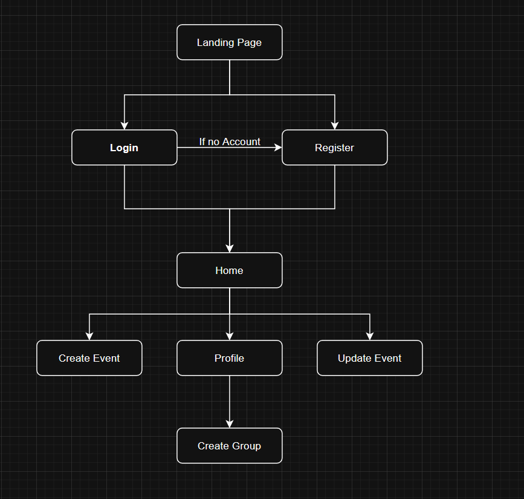

# Web Application Exercise

A little exercise to build a web application following an agile development process. See the [instructions](instructions.md) for more detail.

## Product vision statement

Gathr simplifies event planning for organizers and guests by providing a platform where hosts can create events, manage guest lists, track RSVPs, and update event details while guests stay informed about upcoming events and update their RSVP status, ensuring seamless communication for friend groups and families.

## User stories

[Link to User Stories](https://github.com/software-students-spring2025/2-web-app-the-get-requesters/issues)

## Site Map

## Prototype

## Steps necessary to run the software

1. Clone the project: `git clone https://github.com/software-students-spring2025/2-web-app-the-get-requesters.git`
2. `cd` into the project directory: `cd 2-web-app-the-get-requesters`
3. Set up a Virtual Environment: `python3 -m venv venv`
4. Activate the Virtual Environment: `source venv/bin/activate`
5. Install the necessary libraries: `pip install -r requirements.txt`
6. Run the web app: `python3 app.py`
7. View the web app in the browser: `http://localhost:5001/`

## Task boards

[Sprint 1 Taskboard](https://github.com/orgs/software-students-spring2025/projects/12)
[Sprint 2 Taskboard](https://github.com/orgs/software-students-spring2025/projects/76)
