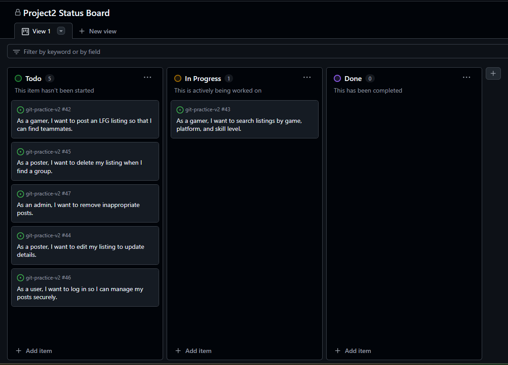

# Web Application Exercise

A little exercise to build a web application following an agile development process. See the [instructions](instructions.md) for more detail.

## Product vision statement

The LFG App helps gamers find teammates quickly by posting and searching for multiplayer game listings.

## User stories

1. As a gamer, I want to post an LFG listing so that I can find teammates.
2. As a gamer, I want to include specific descriptions so that I better find potential teammates.
3. As a gamer, I want to search listings by game so that I can find a better match.
4. As a gamer, I want to search the post my level so that I can find the best match.
5. As a poster, I want to edit my listing to update details so that I can adjust information in case I make mistakes.
6. As a poster, I want to delete my listing when I find a group.
7. As a user, I want to have more than one account to log in so that I can have multiple accounts for different games.
8. As a user, I want to have a log in so that I can manage my posts securely.
9. As an admin, I want to search the descriptions so that I can keep track of inappropriate speech. 
10. As an admin, I want to have more access so that I can remove inappropriate posts.
11. As an admin, I want to have some access so that no one else can remove my posts.

## Steps necessary to run the software

See instructions. Delete this line and place instructions to download, configure, and run the software here.

## Task boards
Our initial status

